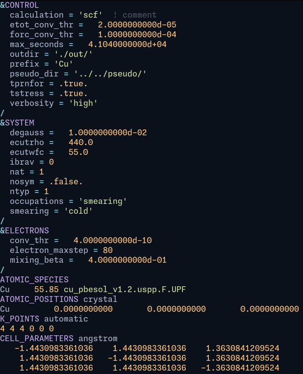

# tree-sitter-quantum_espresso

[Quantum ESPRESSO](https://gitlab.com/QEF/q-e) grammar for tree-sitter.

Provides syntax highlighting for QE input files, e.g., `scf.in`.

<figure>

<figcaption>Syntax highlighting in <code>helix</code> editor with theme <code>material_deep_ocean</code> for <code>pw.x</code> input.</figcaption>
</figure>

## Usage

- Test it in CLI

    ```shell
    # Highlight file
    tree-sitter highlight example.in
    ```

- For `neovim`, see <https://github.com/nvim-treesitter/nvim-treesitter>
- For `helix`, refer to <https://github.com/qiaojunfeng/tree-sitter-wannier90/blob/main/docs/helix.md>

## Development

```shell
# Install dev dependencies
npm build

# Generate parser & language bindings
tree-sitter generate

# Test grammar
tree-sitter test
```

## Reference

- <https://tree-sitter.github.io/tree-sitter/creating-parsers>
- <https://github.com/ikatyang/tree-sitter-toml>
- <https://github.com/stadelmanma/tree-sitter-fortran>
- <https://gitlab.com/QEF/q-e>
